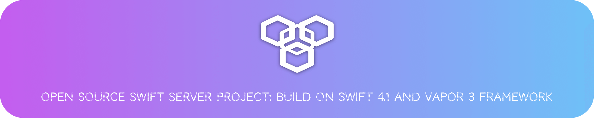

    
     
     
    
    
    

[中文文档🇨🇳](README_CN.md) 

This is a Swift Server Side open source project build on the [Swift 4.1](https://swift.org) and [Vapor 3](http://vapor.codes) frameworks.

Because of apple’s release of the cool event-driven non-blocking network framework [SwiftNIO](https://github.com/apple/swift-nio), Vapor 3 introduced it at a blazing pace, leading to Vapor 2 and Vapor 3. The grammar is very different. For me personally, it looks like the difference between Swift 2 -> Swift 3 is awkward. So I used Vapor 3 to rewrite part of the interface and open it for reference and communication with interested partners.
Currently listed in the document [API](Source/API.md) has been deployed in a formal environment application, and will continue to be perfected as needed.

##### Projects are deployed at [http://api.jinxiansen.com](http://api.jinxiansen.com) (Ubuntu 16.04), most api can be debugged directly here.

Here are just a few basic API and instructions. For more information, please download the project.

## Preview 📑

 [👉 **From here**](Source/API.md) , preview the currently completed API sample documentation and debugging.

## Installation 🚀

**Preliminary work of running the project:**

* [**Ddownload 📁**](https://github.com/Jinxiansen/SwiftServerSide-Vapor/archive/master.zip) the server side swift project；
* [**Learn 📚**](Source/Install.md) how to quickly install `Vapor 3` and `PostgreSQL`.

> If you prefer mysql, you can see [here](https://github.com/Jinxiansen/SwiftServerSide-Vapor/tree/mysql).

## Feedback 🤔

If you have any questions or suggestions, you can submit a [Issue](https://github.com/Jinxiansen/SwiftServerSide-Vapor/issues) , 

or contact me with email: [hi@jinxiansen.com](hi@jinxiansen.com) 

## License 📄

SwiftServerSide-Vapor is released under the [MIT license](LICENSE). See LICENSE for details.
